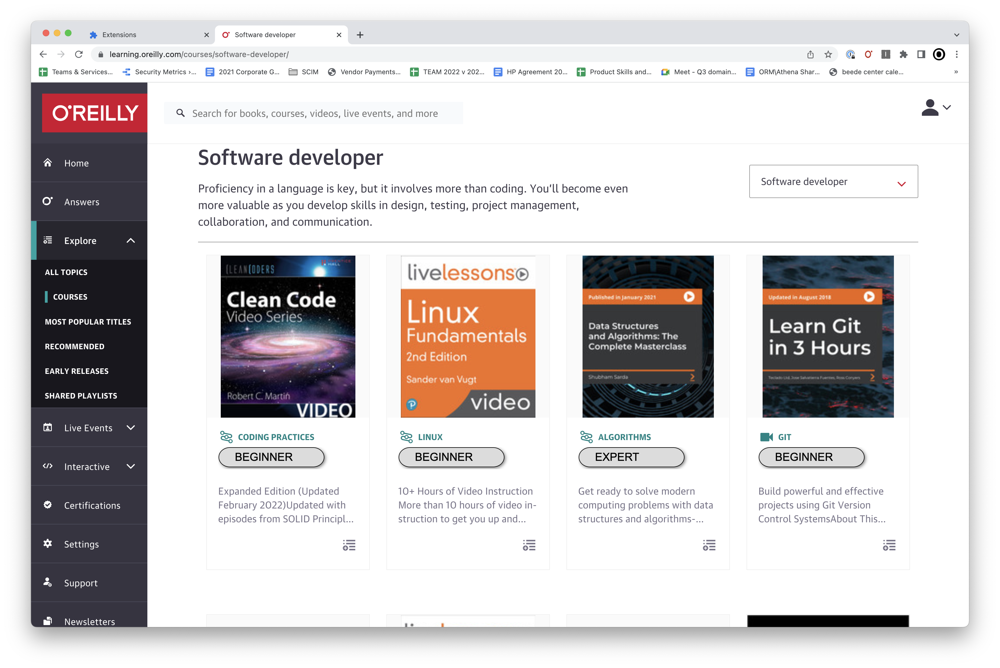

# Rating content difficulty with GPT-3

O'Reilly customers frequently object to our lack of content difficulty ratings (e.g., beginner, intermediate, or advanced). We've explored various ways to generate this metadata (ML models, Mechanical Turk, scraping data from publishing partners, etc.), but none have proved viable.

This brief describes how we might use OpenAI's GPT-3 language model as a solution. The idea is to create a narrative description called a "prompt" that descibes what we want and then ask GPT-3 to propose a level based on a given title. For example:

```
I have a library of various learning materials consisting of books, courses and videos.  They
are geared to a technical audience, usually software developers, engineers, or
data scientists.  There are also some non-technical topics, like business or design.

I want to classify each of the following learning materials into one of the following
categories: beginner, intermediate, or advanced.

A beginner topic is one that is suitable for someone who is new to the topic.  It might
contain words like "introduction", "basics", "getting started", "fundamentals", or "tutorial".
Many of these will be on specific technical subjects, like "Python", "JavaScript", "React", "SQL", or "Linux

An advanced topic is one that is suitable for someone who has a lot of experience with the
topic.  It might contain words like "advanced", "expert", "advanced", or "mastering". These
are often on more advanced topics like "machine learning", "deep learning", "artificial intelligence", "architecture", "design patterns", or "data science".

An intermediate topic is one that is suitable for someone who has basic experience with the
topic but want to go further. If you're not sure if a topic is beginner or advanced, it's probably intermediate.

Here are a few examples:

Learning Go => beginner
Designing Data Intensive Applications => advanced
Head First Python => beginner
Clean Code Fundamentals => beginner
Fluent Python => intermediate
Advanced Mechanics of Materials and Applied Elasticity => advanced
Data Structures and Algorithms: The Materclass => advanced
The Art of Unit Testing => intermediate
An Agile Crash Course: Agile Project Management and Agile Delivery => intermediate
Building Microservices => advanced
User Experience Essentials => beginner
Practical Linear Algebra for Data Science => advanced

Given this, would you classify "Fundamentals of Python" as beginner, intermediate, or advanced?
```

Passing this example to the OpenAI GPT-3 API yields the response `beginner`. No code, NLP models, complex logic, stemming, or tokenization required.

Here's some sample output from the PoC:



The advantages of this approach include:

- _Editorially driven_. This approach allows content experts, rather than engineers, to tweak the prompt and tune the results. This iterative process, sometimes called "prompt engineering", will let us refine the language in the prompt until it provides a desired level of accuracy.
- _Scalablity_. It is trivial to apply the model to our entire corpus of content.
- _No training data_. It does not require extensive training data to build a formal classifier. The need for thousands of samples has been a major impediment to prior efforts, and this approach eliminates the need almost entirely.
- _Cost effectiveness_. My initial estimates are that it would cost around $500 to compute difficulty levels for all content. (This is just raw cost of the API, and excludes things like the time required to refine the prompt.)

Some disadvantages include:

- _The "Black box" problem_. GPT-3 is a black box, so it's impossible to understand why it makes the choices it makes. Unlike a tradional programming language, one can only influence it by altering the prompt. While this might have the desired effect on some cases, it might also lead to poorer performance in other areas. We can counter this with a rigorous process for evaluating the overall accuracy (see below).
- _Reliance on an external vendor_. There's an argument that this should be an in-house competency. Until we have capacity for this, however, an outside vendor make sense, as it does with Miso.
- _Potentially lower quality than a human rating_. A learner who digs deeply into the content might ultimately disagree with GPT-3's classification. Of course, the same might be true of any ranking system, even one created by the author of the learning content, since level of difficulty is inherently subjective. (For example, "Introduction to Quantum Physics" would be a beginner title to a physicist, but I would find it baffling.) Consequently, we should build in some type of feedback mechanism from users for this or any other ranking system to evaluate the overall credibility of this metadata.

## Process

The success of this approach hinges on finding a prompt that accurately classifies most content. Here's a process we can follow:

1. Develop an initial prompt
2. Test the prompt by sampling various titles and rating the overall quality (see below)
3. Evaluate the model's failures and update the prompt accordingly
4. Go back to step 2 and repeat until we achieve the desired accuracy

Once the model is performing adequately, we can then compute the levels across the entire corpus. The data can then be used as part of a "difficuly level" microservice, incorporated as a search facet, or used wherever it's needed in the product experience. The classification process could also be added as a step in the ingestion process, similar to the way we added automated transcriptions for videos.

## Measuring accuracy

We can use sampling to evaluate the quality of the prompt. For example, suppose we select `N` titles at random and have GPT-3 assign them levels. We then have a human review and note the ones that are inaccurate. Let's call this number `f` for failure. A rough measure of the models accuracy is then:

Accuracy = (N-f)/N

We can then tweak the prompt based on what we learn. For example, the prompt might consistently rate things as intermediate that should be advanced, or misclassify topics based on difficulty, or whatever. We'd then modify the prompt and rerun the sample until the accuracy is greater than some product-driven threshold (e.g., 80%).

It will likely take a lot of trial and error to figure out how to tweak the prompt, so a clean UX for this process will be critical.

NB: _It will be important to track the version history of the prompt against the result. Storing the prompt in github and using the commit SHA as a version number should be a pretty effective way to maintain the connection._

### Experiment design

NEED SOME STATISTICS WORK HERE

- Given a 70K population, what sample size do we need
- How many samples should we take
- What would our confidence interval be on the accuracy
- What would the UI look like?

### Measuring accuracy by using GPT-3 against itself

Human-in-the-loop evaluators might be expensive, difficult to find, and/or hard to manage. Might we use GPT-3 adversarialy to check its own answers? In other words, GPT-3 in the loop.

As inspired by Adam Witwer, we could have GPT-3 evaluate its own answer. For example, GPT-3 might classify "Bash Shell Scripting" as an intermediate title:

Prompt: `Do you agree that "Bash Shell Scripting" is an intermediate level course?`

Response: `No. Bash shell scripting is an advanced topic because it requires knowledge of the Linux command line.`

While a human evaluator might not always have the same answer, applied in large enough quantities something like this should provide a meaningful accuracy measurment.

To do this we'd generate a sample of size `N`, use GPT-3 to evaluate the results to find `f`, and then compute the accuracy as described previously. Since it's entirely automated, we could repeat this process however many times we need to get a reasonable meaure of the overall accuracy. (It's worth noting that this process could also measure the quality for any of our classification system, such as topic assignments.)

Taking this idea further, you could imagine a process where you use GPT-3 to suggest improvements to the prompt itself. For example:

```
Here's a prompt to classify technical categories into levels:

PROMPT

Here are a few examples of how it failed:

FAILURE 1
FAILURE 2
FAILURE 3
...
FAILURE N

What are some edits that would help improve the prompt to catch these errors?
```

This might be pushing the boundaries, but it should be relatively simple to implement. I'm continuously surprised by how good GPT-3 is, so it's certainly worth a shot.

## Cost Analysis

Once we have a prompt that yields an acceptable level of accuracy, we'll need to apply it to the full list of content title. Here are a few assumptions needed to estimate the costs for this:

- ~70,000 titles to classify
- ~300 tokens per prompt
- $0.02 / 1000 tokens (Current price for the DaVinci model)

So, the cost to classify the full catalog would be:

70,000 titles x 300 tokens per prompt x \$0.02 / 1,000 tokens = \$420

# Proof of concept

I've built a minimal proof of concept to test key parts of this idea. It consists of two parts: a server and a client.

The `server` is a cloud function that submits a hard-coded initial prompt that's paired with with a specific work to be classified. The function then returns the classification, either as JSON output or as an SVG image. Here's the JSON format:

```
http GET https://us-central1-gpt3-experiments-sparktime.cloudfunctions.net/gpt3_content_level_classifier?format=json&title=learning+go

{
"level": "beginner"
}
```

Here is the SVG format that generates an image pill that is used in the Chrome extension (note the `format=svg` in the query string):

```
http GET https://us-central1-gpt3-experiments-sparktime.cloudfunctions.net/gpt3_content_level_classifier?format=svg&title=learning+go

  <svg xmlns="http://www.w3.org/2000/svg" width="200" height="40" viewBox="0 0 200 40">
    ...
    <rect x="1" y="1" width="190" height="35" fill="gainsboro" filter="url(#dropshadow)" stroke="black" stroke-width="1" ry="20" rx="20"/>
    <text x="30" y="25" font-family="Arial, Helvetica, sans-serif">BEGINNER</text>
  </svg>
```

NB: _You can pass `debug=true` in the query string to supress the call to OpenAI. The level returned is always `intermediate`_.

The `client` is a Chrome extension that runs on every page in the learning platform. Whenever it finds a card element title (i.e., a link with class `orm-Card-link`), it replaces it with an `` tag that links to the SVG output of the classifier:

```
let endpoint = "https://us-central1-gpt3-experiments-sparktime.cloudfunctions.net"
document.querySelectorAll("a").forEach((link) => {
  if (link.className.indexOf("orm-Card-link") > -1) {
    let title = encodeURIComponent(link.innerText);
    let img = document.createElement("img");
    img.src = `${endpoint}/gpt3_content_level_classifier?format=svg&title=${title}`;
    link.parentNode.replaceChild(img, link);
  }
})
```

When you navigate to something like a topic page or a course page, you can quickly see if the responses seem reasonably credible. Based on my quick inspection, even a basic prompt gives OK results.

## Development

There are two main parts to the PoC: the server and the client.

## Server

The server code is in the `./server` directory of this repo. It's deployed as a cloud function, and uses the Google `functions-framework` and `npm-watch` for local development.

To get started, run `npm install` in the `./server` direcory. Once that's finished, run

```
npm start watch
```

To test it locally:

`http GET https://localhost:8080?title=learning+go`

To deploy it to production, use something like this:

```
gcloud functions deploy gpt3_content_level_classifier \
   --allow-unauthenticated \
   --project=gpt3-experiments-sparktime \
   --runtime=nodejs12 \
   --trigger-http  \
   --entry-point gpt3_content_level_classifier \
   --set-env-vars \
   OPENAI_API_KEY=<THE KEY>

```

Not that you'll need to be in a project that has cloud functions enabled. I made a project just for this to keep things organized, but it could probably go wherever. You can also [set the secrets in the cloud function console](https://cloud.google.com/functions/docs/configuring/env-var).

## Client

The client code is in the `./client` directory. It's vanilla javascript that manipulates the DOM, so there is no build step or webpack configuration (ahhhhh, the satisfaction...). To use it:

- Go to `chrome://extensions`
- Turn on developer mode
- Click `Load Unpacked` and select the `./client` subfolder
- Reload the extension whenever you make changes

Note that Chrome will complain about not using HTTPS when it tries to load the SVG images directly from the dev server. It doesn't seem like the `functions-framework` can server HTTPS directl, so I used the following project as a proxy:

https://github.com/cameronhunter/local-ssl-proxy

To install it:

```
npm install -g local-ssl-proxy
```

The run the proxy like this:

```
local-ssl-proxy --source 8081 --target 8080
```

You'll then have to change the local URL for the server function to use the proxy, like this:

`https://localhost:8081?format=svg&title=${title}`

# To Do

- [x] Do cost estimates for the full corpus
- [x] Write product brief
- [ ] Fix hot reload for `npm watch`
- [ ] Cache results in google memory store
- [ ] Cache prompt in memory store and load it on each invocation of the model
- [ ] Move prompt to its own repo and then use a webhook to post it to memeorystore when it is changed. Be sure to also push the SHA of the repo so that you can know what version of the prompt is used
- [ ] Develop a sampling plan and a way to measure quality control of the prompt
- [ ] Develop an API that combines the product metadata (especially ourn) with the prediction. This API should also have a way for someone to manualy override a prediciton in a way that is sticky across different applications of the model.
- [ ] Develop the evaluator model and integrate into a sampling plan
